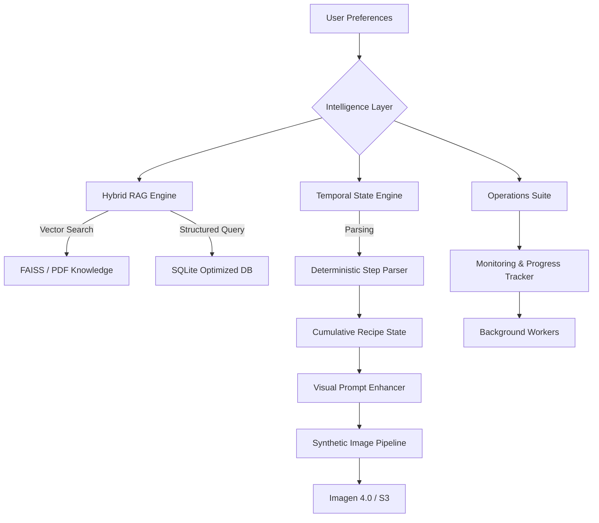

# 🍳 Foodiee: A Context-Aware Culinary Reasoning Engine

Foodiee is a sophisticated **culinary state machine** that bridges the gap between static recipe text and a dynamic, synchronized cooking experience. It maintains a continuous "mental model" of the cooking process through structured state persistence and a high-fidelity synthetic photography pipeline.

---

## 🏗️ System Architecture

Foodiee utilizes a decoupled architecture where the **Intelligence Layer** orchestrates semantic retrieval, deterministic state tracking, and resilient background operations.

---

## Core Engine Pillars

### ⏱️ Temporal Context Management
*   **Structured Parsing**: Dual-pass analysis (Heuristics + LLM) converts raw text into structured `StepAction` objects.
*   **The "Pan Model"**: Tracks **Ingredient Visibility**—it knows if an ingredient is "in the pan" (frying) or "in the pantry" (absent).
*   **Context Persistence**: Prevents LLM "context drift" in long cooking sessions by maintaining a canonical state of the cooking vessel.

### 📸 Synthetic Photography Pipeline
*   **Zero-Text Enforcement**: Strict prompt-engineering ensures images are 100% free of garbled AI text and numbers.
*   **Dynamic Synthesis**: The `VisualPromptEnhancer` automatically adjusts lighting, camera angles, and depth-of-field based on the current cooking stage.
*   **Asset Lifecycle**: Integrated S3 storage with incremental database updates for every generated frame.

### 📚 Hybrid RAG Strategy
*   **Optimized Layer**: Structured SQLite knowledge base (700+ recipes) for 5x faster retrieval.
*   **Exploratory Layer**: FAISS-backed semantic search across PDF cookbooks for rare or complex queries.

---

## 🛠️ Administrative & Operational Suite

Designed for production reliability, Foodiee features a robust set of monitoring and governance tools.

### 📈 Monitoring & Progress Tracking
*   **Real-time Telemetry**: The `ProgressTracker` persists every operational event to Supabase for instant dashboard updates.
*   **Live Logs**: Detailed job logging with severity levels (INFO, SUCCESS, WARNING, ERROR).
*   **Job Metrics**: Track completion counts, failure rates, and skipped items across massive batch generation jobs.

### 🛡️ Resilience & Fault Tolerance
*   **Atomic Checkpointing**: Background workers perform **incremental saves** after every successful image, allowing jobs to resume without redundant API usage.
*   **Exponential Backoff**: Sophisticated retry logic for external APIs (Gemini/Imagen) with 15s initial delays to survive rate-limit bursts.
*   **Graceful Termination**: Workers auto-detect job cancellations and repeated failures to prevent resource exhaustion.

### ⚖️ Data Governance & Quotas
*   **Validation Engine**: Automated LLM checks for "Cuisine Integrity" and "Procedural Logic."
*   **Quota Enforcement**: PostgreSQL-backed credit system that throttles generation at the user level.
*   **Asset Repair**: Admin tools to selectively "fix" recipes missing specific data points (e.g., "Fix all main images for Italian recipes").

---

## 💻 Tech Stack

| Component | Technology |
| :--- | :--- |
| **Backend** | FastAPI, Python 3.10+, LangChain, Pydantic |
| **Frontend** | Next.js 15 (App Router), React 19, Tailwind CSS 4, DaisyUI |
| **Databases** | PostgreSQL (Supabase), SQLite (Local Cache), FAISS (Vector) |
| **AI Models** | Google Gemini 1.5 Pro, Google Imagen 4.0 |
| **Infrastructure** | AWS S3 (Asset Storage), Background Workers (Threading) |

---

## 🤝 Contributing & Development

We welcome professional contributions! To set up your local environment or report issues, please refer to our **[Contributing Guide](CONTRIBUTING.md)**.

---

*Developed by **Oldowan Innovations** for the next generation of AI-assisted culinary arts.*
